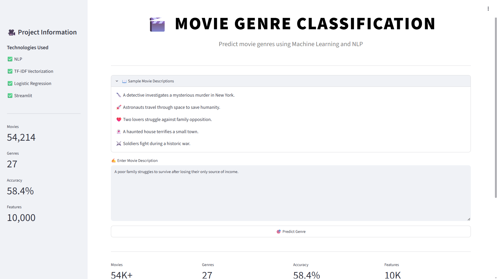
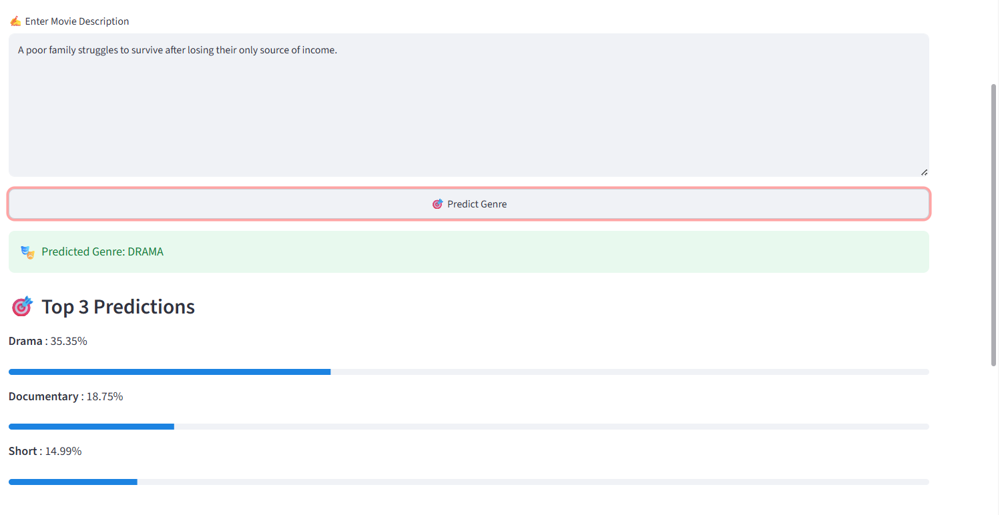
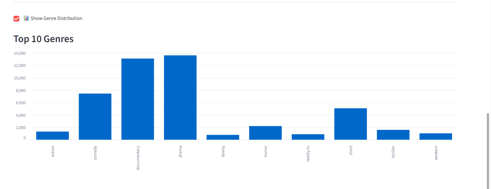

# 🎬 Movie Genre Classification using Machine Learning & NLP

A Machine Learning and Natural Language Processing project that predicts the genre of a movie from its plot description using TF-IDF and classification algorithms.

---

## 📌 Project Overview

Movie genres can often be identified from their plot summaries. This project uses NLP techniques and Machine Learning algorithms to classify movie descriptions into genres such as:

- Drama
- Comedy
- Thriller
- Horror
- Romance
- Action
- Documentary
- Adventure
- Sci-Fi
- Fantasy
- And many more

The application is deployed using Streamlit and provides an interactive user interface for real-time predictions.

---

## 🚀 Features

✅ Movie genre prediction from plot descriptions  
✅ Text preprocessing using NLP techniques  
✅ TF-IDF vectorization  
✅ Logistic Regression / SVM classification  
✅ Interactive Streamlit web application  
✅ Genre distribution visualization  
✅ Professional user interface  
✅ Real-time predictions  

---

## 🛠️ Tech Stack

- Python
- Pandas
- NumPy
- Scikit-learn
- NLTK
- Streamlit
- Matplotlib
- Seaborn
- Joblib

---

## 📂 Project Structure

```text
Movie-Genre-Classification/
│
├── app/
│   └── app.py
│
├── data/
│   └── train_data.txt
│
├── models/
│   ├── genre_model.pkl
│   └── tfidf.pkl
│
├── notebooks/
│   └── EDA.ipynb
│
├── screenshots/
│   ├── home_page.png
│   ├── prediction_page.png
│   └── genre_distribution_chart.png
│
├── requirements.txt
└── README.md
```

---

## 📊 Dataset Information

- Dataset Source: IMDb Movie Genre Dataset
- Total Movies: 54,214
- Total Genres: 27
- Features Used: Movie descriptions

---

## ⚙️ Machine Learning Pipeline

1. Data Collection
2. Text Preprocessing
3. Stopword Removal
4. TF-IDF Vectorization
5. Train-Test Split
6. Model Training
7. Model Evaluation
8. Streamlit Deployment

---

## 🏠 Home Page



---

## 🎯 Prediction Result



---

## 📈 Genre Distribution



---

## 🧠 Model Performance

| Model | Accuracy |
|-------|----------|
| Logistic Regression | 58.38% |
| Linear SVM | 57.04% |

Final model used: **Logistic Regression**

---

## ▶️ Run Locally

### Clone the repository

```bash
git clone YOUR_GITHUB_REPOSITORY_LINK
```

### Move into the project directory

```bash
cd Movie-Genre-Classification
```

### Create virtual environment

```bash
python -m venv venv
```

### Activate environment

```bash
venv\Scripts\activate
```

### Install dependencies

```bash
pip install -r requirements.txt
```

### Run Streamlit

```bash
cd app
streamlit run app.py
```

---

## 🎬 Example Input

```text
A detective investigates a mysterious murder in New York city.
```

### Predicted Genre:

```text
Thriller
```

---

## 📌 Future Improvements

- Top 3 genre predictions
- Genre probability scores
- Movie recommendation system
- Movie poster integration
- Deep learning models
- Transformer-based NLP models

---

## 👨‍💻 Author

**Pranjal Jain**

B.Tech CSIT Student  
Machine Learning & Data Science Enthusiast

---

## ⭐ If you like this project, give it a star on GitHubs.